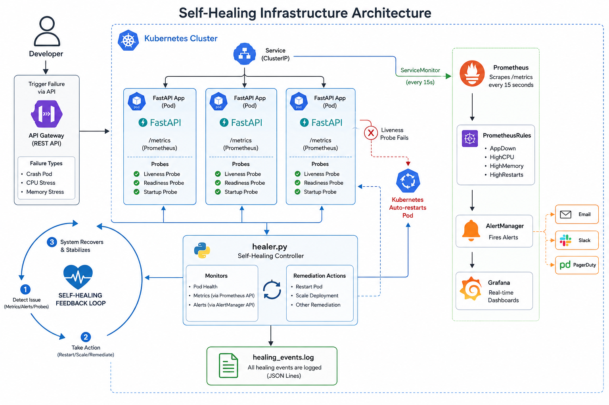
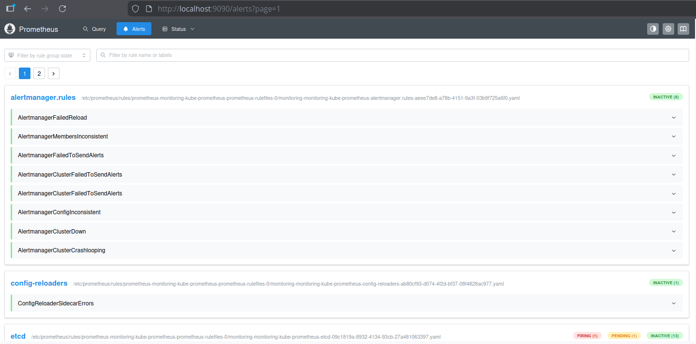
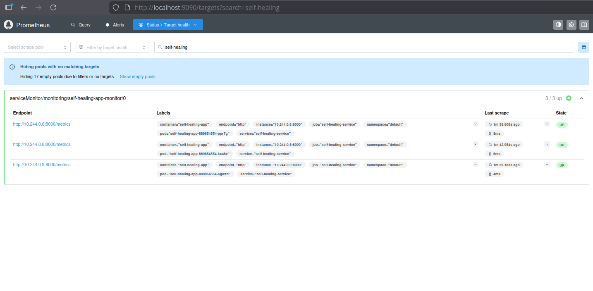
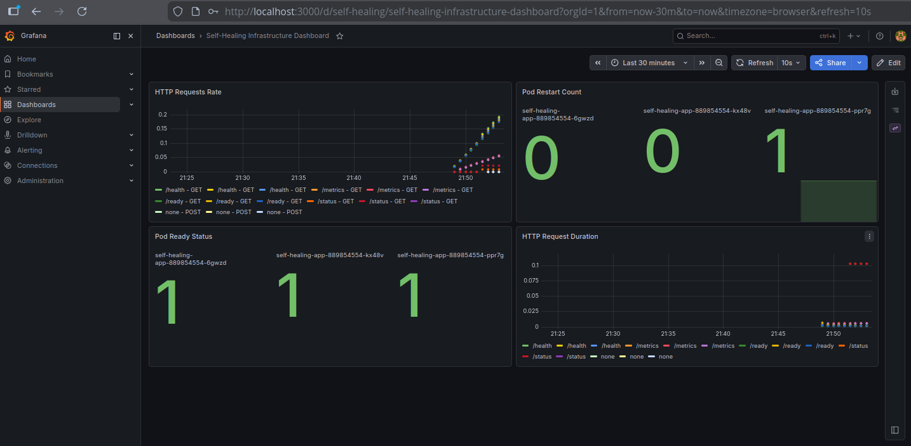

# 🔧 Self-Healing Infrastructure


A production-grade self-healing infrastructure that automatically detects and remediates failures without human intervention.

---

## 🏗️ Architecture



---

## 📸 Screenshots

### Prometheus Alert Rules


### Prometheus Targets (3 pods being scraped)


### Grafana Dashboard


### Auto-Healer in Action


### Pod Self-Healing (kubectl restarts)


---

## ✨ Features

- **Failure Simulation** — Trigger crashes, memory leaks, CPU stress on demand
- **Liveness Probes** — Kubernetes auto-restarts unhealthy pods within 15 seconds
- **Auto-Remediation** — Python healer script detects and fixes specific failure types
- **Auto-Scaling** — Automatically scales pods when CPU exceeds 80%
- **Prometheus Alerts** — 6 custom alert rules for different failure scenarios
- **Grafana Dashboards** — Real-time visualization of healing events
- **Full Audit Log** — Every healing action logged with timestamp

---

## 🛠️ Tech Stack

| Category | Tools |
|---|---|
| Orchestration | Kubernetes (Minikube) |
| Monitoring | Prometheus, Grafana, AlertManager |
| Packaging | Helm (kube-prometheus-stack) |
| API | Python, FastAPI |
| Containers | Docker |
| Scripting | Python (healer.py) |

---

## 🔄 Self-Healing Flow
Failure Detected (crash/high CPU/memory)
↓
Liveness Probe fails (HTTP 500)
↓
Kubernetes restarts pod automatically
↓
Auto-healer script detects and logs event
↓
Prometheus fires alert rule
↓
Grafana dashboard updates in real-time
↓
System restored — zero human intervention

---

## 📁 Project Structure
```
self-healing-infrastructure/
├── app/
│   ├── main.py              # FastAPI app with failure simulation
│   ├── Dockerfile           # Hardened container image
│   └── requirements.txt     # Python dependencies
├── kubernetes/
│   ├── deployment.yaml      # Deployment with liveness/readiness probes
│   └── service.yaml         # NodePort service with named port
├── monitoring/
│   ├── alert-rules.yaml     # 6 custom Prometheus alert rules
│   ├── service-monitor.yaml # Prometheus scrape config
│   └── grafana-dashboard.yaml # Custom Grafana dashboard
└── scripts/
└── healer.py            # Auto-remediation script
```
---

## 🚀 Quick Start

### Prerequisites
- Minikube installed and running
- kubectl configured
- Helm installed
- Python 3.10+

### 1. Clone the repository
```bash
git clone https://github.com/paramshivam0018/self-healing-infrastructure.git
cd self-healing-infrastructure
```

### 2. Build and load Docker image
```bash
docker build -t self-healing-app:v2 -f app/Dockerfile app/
minikube image load self-healing-app:v2
```

### 3. Deploy the application
```bash
kubectl apply -f kubernetes/deployment.yaml
kubectl apply -f kubernetes/service.yaml
```

### 4. Install monitoring stack
```bash
helm repo add prometheus-community https://prometheus-community.github.io/helm-charts
helm repo update
helm install monitoring prometheus-community/kube-prometheus-stack \
  --namespace monitoring --create-namespace \
  --set grafana.adminPassword=admin123
kubectl apply -f monitoring/
```

### 5. Start auto-healer
```bash
pip install -r app/requirements.txt requests
python scripts/healer.py
```

### 6. Simulate failures
```bash
# Simulate crash
curl -X POST http://192.168.49.2:30080/simulate/crash

# Simulate memory stress
curl -X POST http://192.168.49.2:30080/simulate/memory-stress

# Simulate CPU stress
curl -X POST http://192.168.49.2:30080/simulate/cpu-stress

# Recover manually
curl -X POST http://192.168.49.2:30080/simulate/recover
```

---

## 📊 Monitoring

| URL | What it shows |
|---|---|
| http://localhost:9090 | Prometheus — metrics and alert rules |
| http://localhost:9090/alerts | Active alerts |
| http://localhost:3000 | Grafana — dashboards (admin/admin123) |

---

## 🔐 Alert Rules

| Alert | Condition | Severity |
|---|---|---|
| AppDown | App unreachable for 30s | Critical |
| HighPodRestarts | Restarts > 3 | Warning |
| PodNotReady | Pod not ready for 1m | Warning |
| HighMemoryUsage | Memory > 85% | Warning |
| HighCPUUsage | CPU > 80% for 2m | Warning |
| DeploymentReplicasMismatch | Desired != Available | Critical |

---

## 👨‍💻 Author

**Param Shivam**
DevOps Engineer | 5+ Years | Ericsson
📧 paramshivam.in@gmail.com
